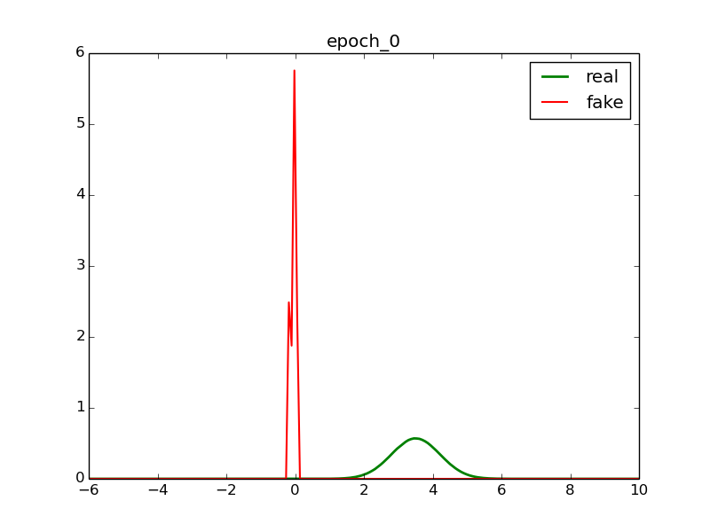
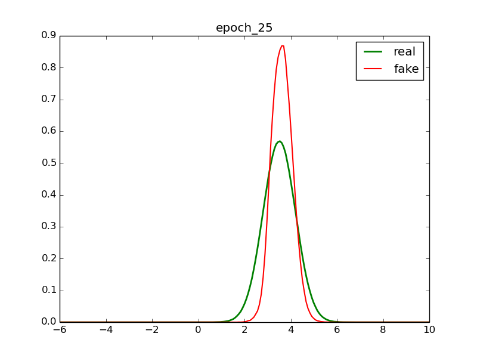
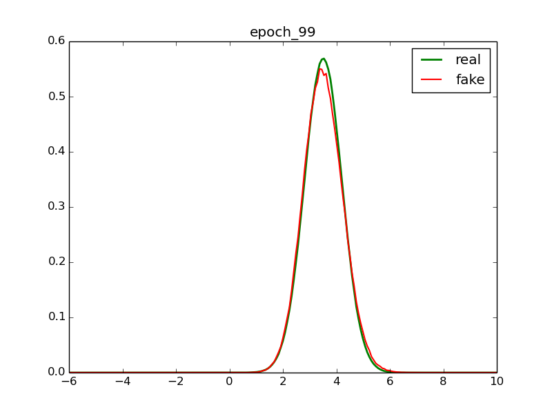
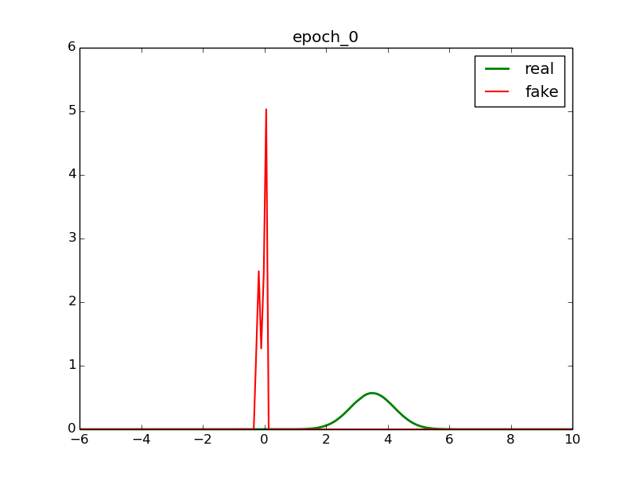
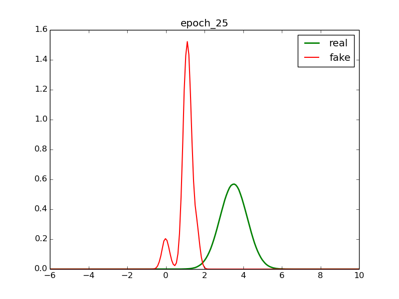
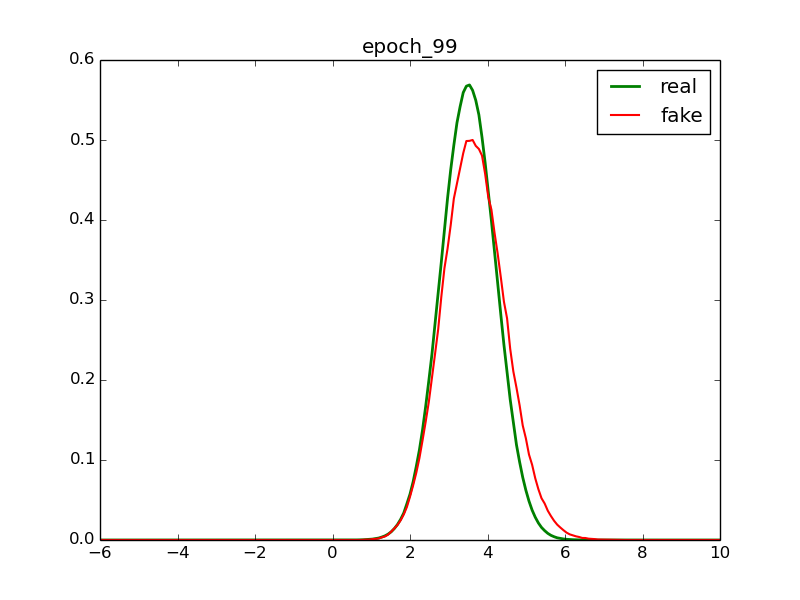
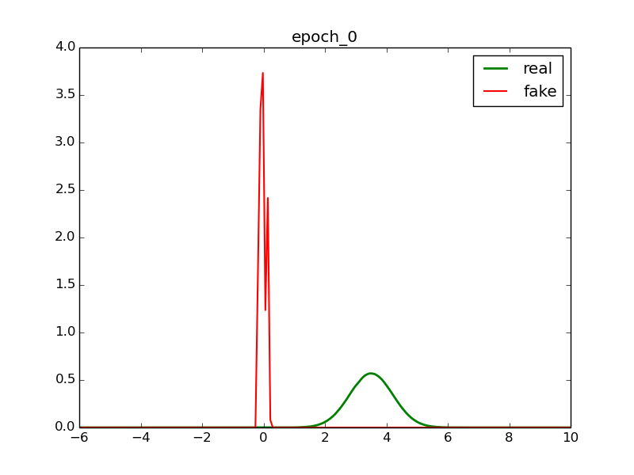
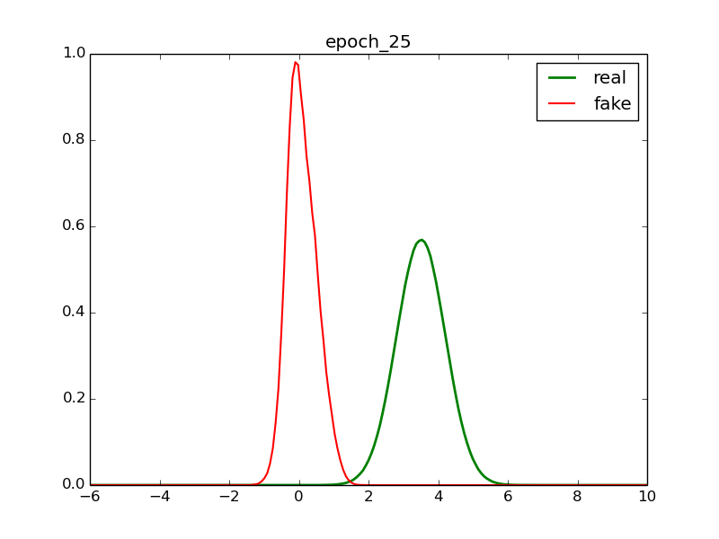
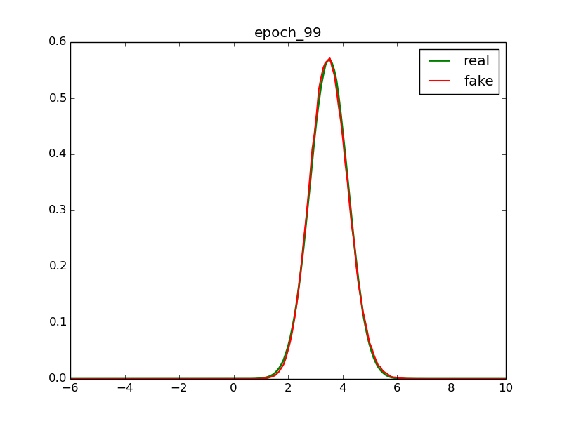

# GAN to generate Normal Distribution

Use GAN to generate Gaussian distribution N(3.5, 0.7).

# Usage

```python
python main.py
```

# Random Generation

*Name* | *Epoch 0* | *Epoch 25* | *Epoch 99*
:---: | :---: | :---: | :---: 
GAN |  |  | 
WGAN |  |  | 
LSGAN |  |  | 
